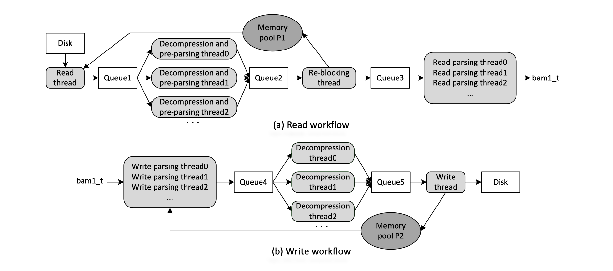

Introduction
============

RabbitBAM is a high-performance BAM file I/O library designed to address the inefficiencies of existing tools on modern multi-core platforms.
By leveraging pre-parsing, parallel parsing, and lock-free data structures, RabbitBAM significantly accelerates BAM processing tasks in both next- and third-generation sequencing workflows.

Key features include:

- High-throughput BAM reading and writing with multi-threaded parsing and lock-free architecture  
- Achieves 2.1–3.3× speedup over HTSlib on NGS data and 1–2.2× on TGS data  
- Lightweight design with minimal dependencies, suitable for embedding in custom bioinformatics pipelines
